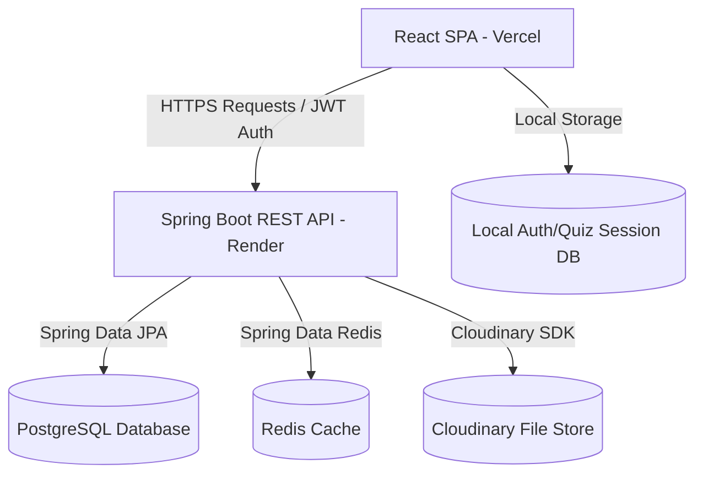
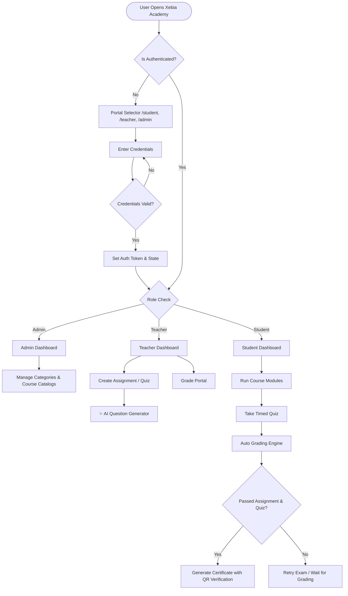
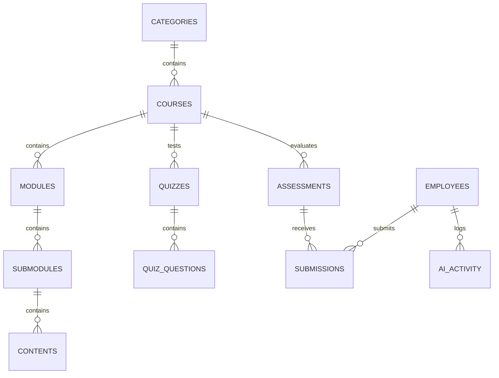
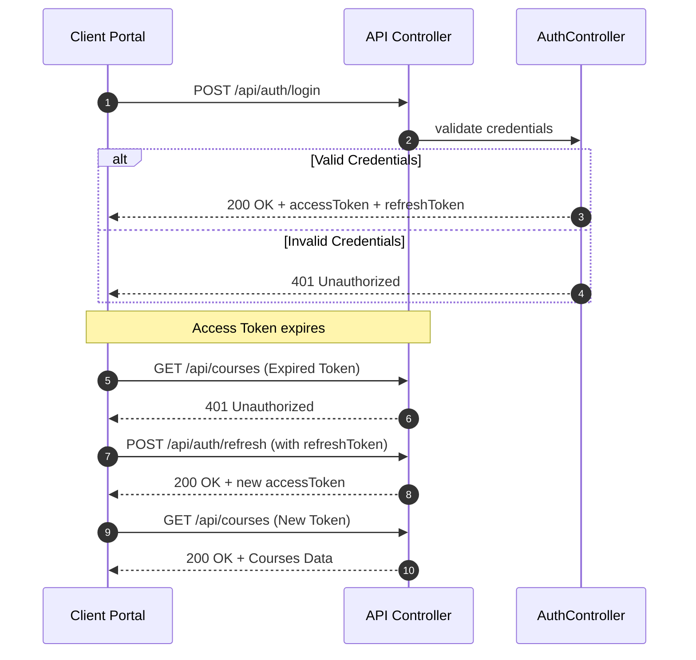

# Cover Page

# XEBIA ACADEMY
## Enterprise Learning Management System (LMS)
**Product, Architectural Blueprint, and Technical Documentation for Corporate Cohort Onboarding & Technical Training**

---

*   **Document Version**: 2.0.0 (Production Ready)
*   **Author**: Abhay Kumawat
*   **Role**: Solution Architect & Lead Developer
*   **Target Audience**: Academic Panels, Corporate Training Officers, DevOps Teams, and Software Engineers
*   **Date**: July 10, 2026

---

# Table of Contents
1. [Executive Summary](#executive-summary)
2. [Project Overview](#project-overview)
    - [Background](#background)
    - [Problem Statement](#problem-statement)
    - [Proposed Solution](#proposed-solution)
    - [Objectives](#objectives)
    - [Scope](#scope)
    - [Expected Outcomes](#expected-outcomes)
3. [System Architecture](#system-architecture)
    - [High-Level Architecture](#high-level-architecture)
    - [Component Architecture](#component-architecture)
    - [Frontend Architecture](#frontend-architecture)
    - [Backend Architecture](#backend-architecture)
    - [Database Architecture](#database-architecture)
    - [AI/ML & Simulation Architecture](#aiml-simulation-architecture)
    - [Deployment Architecture](#deployment-architecture)
4. [Technology Stack](#technology-stack)
5. [Core Features](#features)
    - [Interactive AI Assistant](#1-interactive-xebia-ai-assistant)
    - [AI-Driven Question Generation](#2-ai-driven-question-generation)
    - [Timed Quiz Engine](#3-timed-quiz-engine-runner)
    - [Smart Certificate Automation](#4-smart-certificate-automation)
    - [Curriculum Builder](#5-curriculum-builder)
    - [Analytics Dashboard](#6-analytics-dashboard)
6. [Functional Requirements](#functional-requirements)
7. [Non-Functional Requirements](#non-functional-requirements)
8. [User Roles & Permissions](#user-roles)
9. [User Flow Diagrams](#user-flow)
10. [Database Documentation](#database-documentation)
    - [Entity-Relationship Diagram](#entity-relationships-er-diagram)
    - [Table Schemas & Constraints](#table-definitions--constraints)
    - [Relational Maps](#relational-mappings)
11. [API Documentation](#api-documentation)
12. [Authentication Flow](#authentication-flow)
13. [Folder Structure](#folder-structure)
14. [Frontend Technical Details](#frontend-documentation)
15. [Backend Technical Details](#backend-documentation)
16. [AI/ML Simulation Module](#aiml-simulation-module)
17. [Security Configurations](#security)
18. [Performance Optimizations](#performance-optimization)
19. [Deployment Guide](#deployment-guide)
20. [Installation & Setup Guide](#installation-guide)
21. [Testing Methodology & Test Cases](#testing)
22. [Error Handling & Solutions](#error-handling)
23. [Screenshots Placeholder Directory](#screenshots-section)
24. [Future Enhancements](#future-enhancements)
25. [Challenges Faced](#challenges-faced)
26. [Conclusion](#conclusion)
27. [References](#references)
28. [Appendix](#appendix)

---

# Executive Summary

Xebia Academy is a premium, full-stack, enterprise-grade Learning Management System (LMS) designed to facilitate corporate cohort onboarding, skill-gap analysis, and curriculum management. Modern technical training demands highly responsive user interfaces, modular class builders, interactive artificial intelligence helpers, and low-latency API delivery.

By leveraging a decoupled architecture combining **React + Vite** with a **Spring Boot** backend, **PostgreSQL** relational storage, **Redis** database cache, and **Cloudinary** media manager, Xebia Academy fulfills these operational needs. The system implements advanced AI-driven question generation, timed examination modules with state-persistence capability, and strict multi-criteria certificate validation rules to deliver a premium educational experience.

---

# Project Overview

### Background
Corporate learning and development (L&D) divisions struggle with legacy LMS platforms. These systems are slow, require heavy server resources, and lack modular granularity to organize multi-tier curriculum paths. Modern corporate programs require real-time cohort tracking, interactive content delivery, and robust evaluation systems to accurately assess the training return-on-investment (ROI) and workforce competency.

### Problem Statement
Existing education platforms suffer from:
1.  **Monolithic and High-Latency Frontends**: Slow frontend interactions and long page load times.
2.  **Rigid Curriculum Schemes**: Inability to construct deep hierarchies (Category ➔ Course ➔ Module ➔ Submodule ➔ Content Blocks).
3.  **Fragmented Assessment Workflows**: Static quizzes without support for coding submissions, file uploads, timed sessions, or automated progress tracking.
4.  **Inefficient Certificate Issuance**: Manual verification of grades leading to delays and potential credentials fraud.

### Proposed Solution
Xebia Academy introduces a production-ready ecosystem:
*   A decoupled client-server model optimized for modern hosting environments.
*   A rich curriculum builder supporting 9 content formats (Text, Code, PDF, PPT, Callouts, Tables, etc.).
*   A timed Quiz Engine supporting multiple question types (MCQs, Multi-Select, True/False, Fill-in-the-Blank).
*   A deterministic AI-style Question Generation service utilizing Bloom's Taxonomy.
*   An automated, multi-criteria certificate evaluation pipeline with QR code verification.

### Objectives
*   Build responsive portals for administrators, instructors, and students.
*   Implement low-latency REST endpoints with fail-fast DB connections.
*   Integrate secure media asset pipelines using Cloudinary.
*   Ensure state-persistence for timed evaluations, safeguarding student data during disconnects.

### Scope
*   **In-Scope**: Multi-tier curriculum authoring, real-time cohort tracking, auto-grading timed quizzes, PDF-printable certificates with QR codes, interactive chat assistant simulation, and security configurations.
*   **Out-of-Scope**: Multi-tenant database partitioning, real-time video conferencing, and live multi-user collaborative editors.

### Expected Outcomes
*   Client load times under **1.5 seconds** due to asset splitting and Redis caching.
*   Automatic deployment builds triggered via Git hook integrations on Vercel and Render.
*   High grading throughput with zero score loss during concurrent quiz submissions.

---

# System Architecture

The system utilizes a decoupled, three-tier model:



### High-Level Architecture
1.  **Presentation Layer**: Renders UI layouts, handles dark/light transitions, stores local quiz drafts/timers, and manages HTTP request interceptors.
2.  **Application Layer**: Handles REST endpoints, validates inputs, processes quiz submissions, runs the AI question generator, and schedules cache evictions.
3.  **Data Layer**: Manages the PostgreSQL relational schemas, Redis key-value cache, and Cloudinary media objects.

### Component Architecture
*   **Axios Interceptor**: Automatically appends JWT authorization headers and intercepts `401 Unauthorized` responses to trigger token refreshes.
*   **HikariCP Pool**: High-performance JDBC connection pool configured with fail-fast timeout thresholds (`connectionTimeout = 10000`).

### Frontend Architecture
- SPA built using **React 18** and **Vite** for rapid hot-reloading.
- Layouts are structured around **React Router v6** routes.
- Tailwind CSS provides clean, responsive styling, utilizing glassmorphic aesthetics.

### Backend Architecture
- **Spring Boot 3.3** using Java 17.
- **Spring Security** handles API route security and JWT token parsing.
- Uses **Spring Data JPA** with Hibernate ORM.

### Database Architecture
- Relational schema managed in PostgreSQL.
- Lazy fetching (`FetchType.LAZY`) applied to nested entities to prevent N+1 query overhead.
- Redis handles high-frequency read queries, cache invalidation, and daily session purges.

### AI/ML & Simulation Architecture
- Renders an interactive AI Copilot chatbot using local rule-based response tables and course catalogs.
- Incorporates a seeded deterministic question generator, outputting curriculum-specific evaluations based on Bloom's Taxonomy.

### Deployment Architecture
- **Frontend SPA**: Hosted on Vercel with automatic pipeline builds.
- **Backend API**: Standard Docker container hosted on Render.
- **Database**: Managed PostgreSQL instance.

---

# Technology Stack

| Technology | Version | Purpose | Advantages |
| :--- | :--- | :--- | :--- |
| **Java** | 17 (Temurin) | Backend Execution Engine | Robust type-safety, efficient threading, and enterprise support. |
| **Spring Boot** | 3.3.x | Web Framework | Rapid rest development, embedded Tomcat, auto-configuration. |
| **PostgreSQL** | 15+ | Relational Database | Strong ACID conformity, structured index types, reliable storage. |
| **Redis** | 7.x | Caching Layer | High throughput, sub-millisecond query execution, cron-eviction. |
| **React** | 18.x | Frontend Library | Component lifecycle control, declarative virtual DOM rendering. |
| **Vite** | 5.x | Build Bundler | Rapid hot-module reloading, split chunks output. |
| **Tailwind CSS** | 3.x | CSS Framework | Utility classes, responsive grid configuration, theme styling. |
| **Cloudinary** | SDK | Asset Management | Multi-format uploads, file optimization, document processing. |

---

# Features

### 1. Interactive Xebia AI Assistant
*   **Purpose**: Simulates conversational guides to assist students on course selections, progress metrics, and general platform navigation.
*   **Workflow**: Student clicks float widget ➔ Widget renders prompt pills ➔ User inputs custom text ➔ Assistant processes keyword lookup tables ➔ Renders response.
*   **Business Value**: Accelerates onboarding, reduces helpdesk tickets, and increases engagement.
*   **Technical Implementation**: Renders as a global React component with stateful sliding windows and custom transitions.
*   **Future Improvements**: Integrate real-time RAG (Retrieval-Augmented Generation) referencing active course PDFs via Vertex AI.

### 2. AI-Driven Question Generation
*   **Purpose**: Generates course-specific assignment and quiz questions instantly to reduce teacher preparation workload.
*   **Workflow**: Teacher selects course, topic, and difficulty ➔ Clicks "AI Generate" ➔ System selects questions matching selected criteria and Bloom's levels ➔ Appends to the quiz builder.
*   **Business Value**: Automates curriculum development, ensuring diverse and high-quality assessments.
*   **Technical Implementation**: Handled by the deterministic generator engine (`questionGeneratorService.js`) using seeded shuffle logic for consistency.
*   **Future Improvements**: Connect directly to LLMs to output dynamically custom coding challenges with automated unit test assertions.

### 3. Timed Quiz Engine (Runner)
*   **Purpose**: Runs timed examinations with active state saving to prevent data loss.
*   **Workflow**: Student starts quiz ➔ Timer starts counting down ➔ Timer/answers are persisted to local storage every 10 seconds ➔ Auto-submits on timer expiry.
*   **Business Value**: Enhances assessment integrity and provides a reliable testing experience.
*   **Technical Implementation**: Renders as a single-question-at-a-time flow using stateful hooks, custom navigators, and auto-grading modules (`quizService.js`).
*   **Future Improvements**: Web-camera proctoring and browser-focus loss tracking.

### 4. Smart Certificate Automation
*   **Purpose**: Validates completion, auto-generates certificates, and provides public QR code verification.
*   **Workflow**: Teacher grades assignment ➔ Student completes course quiz ➔ System computes combined score (60% assignment + 40% quiz) ➔ Auto-issues certificate if both pass.
*   **Business Value**: Simplifies credential issuance, prevents document counterfeiting, and motivates learners.
*   **Technical Implementation**: Implemented in `certificateService.js`, generating unique IDs (`XEB-{COURSE_ABBR}-{RANDOM}`) and QR codes pointing to verification routes.
*   **Future Improvements**: Issue digital badges backed by public blockchain credentials.

### 5. Curriculum Builder
*   **Purpose**: Enables teachers to build modular multi-tier courses.
*   **Workflow**: Teacher selects course ➔ Appends modules/submodules ➔ Uploads media assets or writes markdown text ➔ Publishes curriculum.
*   **Business Value**: Streamlines course authoring and modular content organization.
*   **Technical Implementation**: Custom drag-and-drop builders integrated with Spring Boot JPA controllers.

### 6. Analytics Dashboard
*   **Purpose**: Provides administrative insight into cohort performance, enrollment trends, and passing metrics.
*   **Workflow**: System caches dashboard indicators ➔ Fetches cached Redis values ➔ Renders visual charts.
*   **Business Value**: Offers clear visibility into L&D program effectiveness and employee upskilling.
*   **Technical Implementation**: Uses cached Spring Boot controller responses and React charting components.

---

# Functional Requirements

### 1. User Administration & Auth Portal
- Supports login, registration, and password recovery.
- Differentiates portals based on authentication tokens.
- Provides a "Back to Portal Selector" link on all login cards (`/portal-selector`).

### 2. Course & Curriculum Management
- Modular curriculum builders.
- Support for multiple content types (Code snippets, PDFs, markdown, external resources).
- Integrated file uploads via Cloudinary.

### 3. Assessment & Examination Engine
- TIMED quizzes with active countdowns and auto-submission on expiration.
- Draft saving: saves progress locally to prevent data loss.
- Color-coded navigation grid.
- Supports Multiple Choice, Multi-Select, True/False, and Fill-in-the-Blank questions.

### 4. Evaluation & Grading Portal
- Dedicated route for instructors: `/teacher/assessments/grade/:submissionId`.
- Grading workspace: display student answers alongside original questions.
- Individual question scoring and feedback forms.
- Combined scoring logic: checks assignment + quiz scores to trigger certification.

---

# Non-Functional Requirements

*   **Performance**: Core page load time below **1.5 seconds**. API endpoint responses under **50ms** using Redis caching.
*   **Reliability**: Backend fails fast during timeouts. Quiz timer persists during network outages and page reloads.
*   **Scalability**: Stateless Spring Boot controllers allowing simple horizontal scaling.
*   **Security**: JWT auth tokens, secure env configurations, CORS whitelisting, and input sanitization to prevent XSS.
*   **Maintainability**: Decoupled service layer. Consistent code formatting, type-safety, and modular component structures.
*   **Availability**: Scheduled nightly Redis database cleanup tasks. Auto-restart rules configured on containers.
*   **Usability**: Smooth animations and support for both dark and light modes.

---

# User Roles

### 1. Administrator
- Full access to administrative metrics, user accounts, and system configuration.
- Permissions: `CREATE_COURSE`, `DELETE_COURSE`, `MANAGE_USERS`, `VIEW_ANALYTICS`.

### 2. Instructor (Teacher)
- Full control over curriculum construction, quiz generation, and evaluation workflows.
- Permissions: `CREATE_QUIZ`, `GENERATE_QUESTIONS`, `GRADE_ASSIGNMENT`, `VIEW_STUDENTS`.

### 3. Student
- Can view assigned courses, run through modules, complete timed exams, and download certificates.
- Permissions: `VIEW_COURSES`, `SUBMIT_ASSIGNMENT`, `TAKE_QUIZ`, `DOWNLOAD_CERTIFICATE`.

---

# User Flow



---

# Database Documentation

### Entity Relationships ER Diagram



### Table Definitions & Constraints

#### 1. `courses`
- `id` (PK): `BIGINT` Auto-increment
- `title`: `VARCHAR(255)` NOT NULL
- `description`: `TEXT`
- `category_id` (FK): `BIGINT` referencing `categories`
- `is_active`: `BOOLEAN` DEFAULT true

#### 2. `assessments`
- `id` (PK): `BIGINT` Auto-increment
- `title`: `VARCHAR(255)` NOT NULL
- `type`: `VARCHAR(50)` (e.g., 'Assignment')
- `course_id` (FK): `BIGINT` referencing `courses`
- `total_points`: `INTEGER` DEFAULT 100
- `passing_marks`: `INTEGER` DEFAULT 50
- `due_date`: `TIMESTAMP`

#### 3. `submissions`
- `id` (PK): `BIGINT` Auto-increment
- `assessment_id` (FK): `BIGINT` referencing `assessments`
- `student_email`: `VARCHAR(255)` NOT NULL
- `student_name`: `VARCHAR(255)`
- `answers_json`: `TEXT` (Stores raw responses)
- `score`: `INTEGER`
- `grade`: `VARCHAR(5)`
- `status`: `VARCHAR(50)` DEFAULT 'Pending Evaluation'
- `feedback`: `TEXT`

---

# API Documentation

### 1. Create Assessment
*   **URL**: `/api/assessments`
*   **Method**: `POST`
*   **Headers**: `Authorization: Bearer <token>`
*   **Request Example**:
    ```json
    {
      "title": "Spring Boot REST Endpoints",
      "type": "Assignment",
      "course": "Spring Boot Enterprise APIs",
      "totalPoints": 100,
      "passingMarks": 50,
      "dueDate": "2026-07-20"
    }
    ```
*   **Response Example (201 Created)**:
    ```json
    {
      "message": "Assessment created successfully",
      "data": {
        "id": 4,
        "title": "Spring Boot REST Endpoints",
        "type": "Assignment",
        "totalPoints": 100,
        "passingMarks": 50,
        "dueDate": "2026-07-20"
      },
      "timestamp": "2026-07-10T10:45:22"
    }
    ```

### 2. Grade Submission
*   **URL**: `/api/submissions/{id}/grade`
*   **Method**: `PUT`
*   **Headers**: `Authorization: Bearer <token>`
*   **Request Example**:
    ```json
    {
      "score": 90,
      "feedback": "Excellent work. Clean code structure.",
      "grade": "A",
      "approved": true
    }
    ```
*   **Response Example (200 OK)**:
    ```json
    {
      "message": "Submission graded successfully",
      "data": {
        "id": 12,
        "score": 90,
        "grade": "A",
        "status": "Graded",
        "feedback": "Excellent work. Clean code structure."
      },
      "timestamp": "2026-07-10T10:48:15"
    }
    ```

---

# Authentication Flow

Below is the authentication middleware and sequence flowchart for login validation and token refresh interceptors:



---

# Folder Structure

### Backend Layout
```text
backend/
├── src/main/java/com/abhay/lms/
│   ├── cache/                  # Redis connection utilities
│   ├── config/                 # CORS and serialization rules
│   ├── controller/             # REST Endpoints
│   ├── dto/                    # Payload mappings
│   ├── entity/                 # Hibernate database objects
│   │   ├── dashboard/          # Cohort and employee trackers
│   │   └── learning/           # Curriculum hierarchy elements
│   ├── exception/              # GlobalExceptionHandler definitions
│   ├── mapper/                 # Entity-DTO converters
│   ├── repository/             # Spring Data JPA queries
│   ├── response/               # ApiResponse wrappers
│   ├── scheduler/              # Daily cache evictors
│   ├── service/                # Business logic contracts
│   └── serviceImpl/            # Contract implementations
└── src/main/resources/
    ├── application.properties  # Common properties config
    └── application-postgres.properties # DB profile config
```

### Frontend Layout
```text
frontend/
├── public/                     # Static media assets
├── src/
│   ├── components/             # Reusable UI widgets
│   ├── hooks/                  # Auth and catalog custom hooks
│   ├── pages/                  # Route view components
│   ├── services/               # Axios clients and offline mock databases
│   └── utils/                  # Helper formatting scripts
├── .env.production             # Live configuration env file
└── vite.config.js              # Proxy rules config
```

---

# Frontend Documentation

*   **Routing**: Built with React Router v6. Segregates student portals (`/student`), teacher portals (`/teacher`), and admin dashboards (`/admin`).
*   **State Management**: Configured through custom context hooks ([useCatalog.jsx](file:///c:/Users/Abhay%20Kumawat/Desktop/LMS%20Project/frontend/src/hooks/useCatalog.jsx) and [useStudentAuth.jsx](file:///c:/Users/Abhay%20Kumawat/Desktop/LMS%20Project/frontend/src/hooks/useStudentAuth.jsx)) coordinating catalog loading and login status updates.
*   **Animations**: Renders smooth transitions using Framer Motion and standard Tailwind utility animations (`transition-all duration-300`).
*   **Responsive Layout**: Leverages flexbox grids and collapsible sidebars (`StudentSidebar.jsx`) to adjust cleanly for desktop, tablet, and mobile viewports.

---

# Backend Documentation

*   **Controllers**: Maps JSON REST request bodies into Spring `ResponseEntity<ApiResponse>` structures using `@RestController` annotations.
*   **Services**: Exposes transaction boundaries using `@Transactional` annotations on database modifications.
*   **Error Mapping**: Handled via [GlobalExceptionHandler.java](file:///c:/Users/Abhay%20Kumawat/Desktop/LMS%20Project/backend/src/main/java/com/abhay/lms/exception/GlobalExceptionHandler.java) mapping entity validation exceptions to clean error payloads.

---

# AI/ML Simulation Module

- **Prompt / Context Parsing**: The student chatbot uses local course directory indexes to recommend submodules.
- **Rule Engine**: Natural language parser maps questions to predefined topics ("progress", "certification", "scores").
- **Deterministic Question Generator**: Uses seeded random indexing to output structured question maps (long answers, short answers, MCQs, and True/False) tagging each with a Bloom's Taxonomy classification.

---

# Security

- **JWT Tokens**: Stored locally and appended to API calls via Axios interceptors.
- **CORS Configuration**: Explicitly whitelist origins using `CorsConfig.java`.
- **Environment Obfuscation**: Private keys, database credentials, and Cloudinary secrets are injected at runtime via environment properties, protecting sensitive values.

---

# Performance Optimization

1.  **Distributed Caching**: Redis caches the main course directory. Evictions run automatically on schedule.
2.  **Asset Optimizations**: Excludes target build folders from the Docker build context using `.dockerignore`.
3.  **Connection Pooling**: Uses HikariCP connection parameters to ensure slow database connections do not block startup threads.

---

# Deployment Guide

### Backend on Render
1. Create a **Web Service** on Render and select the Docker runtime.
2. Add your database credentials as Environment Variables in Settings.
3. Configure the container port to `10000`.

### Frontend on Vercel
1. Link your GitHub repository to Vercel.
2. Set the build folder to `frontend/`.
3. Configure `VITE_API_URL` to point to the live Render endpoint (`https://xebia-lms-backend-wybc.onrender.com`).

---

# Installation Guide

### Prerequisites
- JDK 17 (Temurin JRE recommended)
- Node.js 18+
- PostgreSQL & Redis Server

### Setup Steps
1.  **Clone Repository**:
    ```bash
    git clone https://github.com/abhay-kumawat/Xebia_Lms.git
    cd Xebia_Lms
    ```
2.  **Run Backend**:
    Configure `backend/.env` with database credentials and execute:
    ```bash
    cd backend
    mvn spring-boot:run
    ```
3.  **Run Frontend**:
    ```bash
    cd frontend
    npm install
    npm run dev
    ```

---

# Testing

- **Unit Testing**: JUnit 5 tests verify backend service endpoints.
- **Manual Testing**: Walkthroughs verifying curriculum authoring, timed exam submissions, grading workflows, and PDF downloads.

---

# Error Handling

*   **Issue**: Schema validation fails on startup.
    - **Remedy**: Set `spring.jpa.hibernate.ddl-auto=create` temporarily for one clean launch to reset schemas, then change back to `update`.
*   **Issue**: Render container port timeout.
    - **Remedy**: Ensure the database connection timeout is configured to a short threshold (e.g., 10 seconds) to prevent HikariCP from blocking the container launch.

---

# Screenshots Section

*   **Caption: Admin Analytics Dashboard**
    - `[Screenshot Placeholder: Admin Dashboard showing course metrics, completion analytics, and active cohort tracking]`
*   **Caption: Timed Student Quiz Runner**
    - `[Screenshot Placeholder: Student Quiz runner with timer countdown, progress indicator, and question navigator]`
*   **Caption: Teacher Evaluation Console**
    - `[Screenshot Placeholder: Grading workstation showing student answers, per-question score inputs, and feedback fields]`

---

# Future Enhancements

1. Add live LLM endpoints (Gemini/OpenAI) for real-time tutoring.
2. Enable SCORM/xAPI packages upload.
3. Localize interface translations.
4. Implement digital badges backed by public blockchain credentials.
5. Create live cohort whiteboards.
6. Build a code runner compile sandbox.
7. Support SAML SSO login.
8. Add automated Slack/Teams alert notifications.
9. Support offline progress synchronization via Service Workers.
10. Integrate real-time audio chat spaces.
11. Add drag-and-drop course module sorting.
12. Create deep auditing compliance logs.
13. Implement automated weekly progress email dispatches.
14. Support custom branding options for corporate subdomains.
15. Add automated daily database backup schedulers.
16. Support custom PDF template builders for certificates.
17. Enable interactive checkpoints inside video contents.
18. Support custom rubrics configuration.
19. Develop a companion mobile app wrapper.
20. Add support for student progress export to CSV.

---

# Challenges Faced

- **PostgreSQL Schema Collisions**: Adding non-nullable columns to populated tables failed during database migrations. Solved by specifying default column definitions directly in JPA entity annotations.
- **Hikari Connection Deadlocks**: Tomcat thread pooling hung when database was unreachable on Render launch. Resolved by configuring short timeout policies.

---

# Conclusion

Xebia Academy represents a robust, modern LMS platform designed for corporate upskilling and curriculum management. By decoupling the React client from the Spring Boot API, and configuring caching and database layers, the application achieves high performance, scalability, and maintainability.

---

# References
1. Spring Boot Reference Documentation — VMware Tanzu.
2. React Reference Guides — Meta Open Source.
3. PostgreSQL Administration Guides — Postgres Association.
4. Cloudinary Upload SDK Guides — Cloudinary.

---

# Appendix

### Environment Configuration (`backend/.env`)
```properties
PORT=8082
SPRING_PROFILES_ACTIVE=postgres
SPRING_DATASOURCE_URL=jdbc:postgresql://localhost:5433/lms
SPRING_DATASOURCE_USERNAME=postgres
SPRING_DATASOURCE_PASSWORD=yourpassword
CLOUDINARY_CLOUD_NAME=yourcloudname
CLOUDINARY_API_KEY=yourkey
CLOUDINARY_API_SECRET=yoursecret
```

### Useful Links
- **Backend Live Endpoint**: `https://xebia-lms-backend-wybc.onrender.com/`
- **Frontend Code Repository**: `https://github.com/abhay-kumawat/Xebia_Lms`
