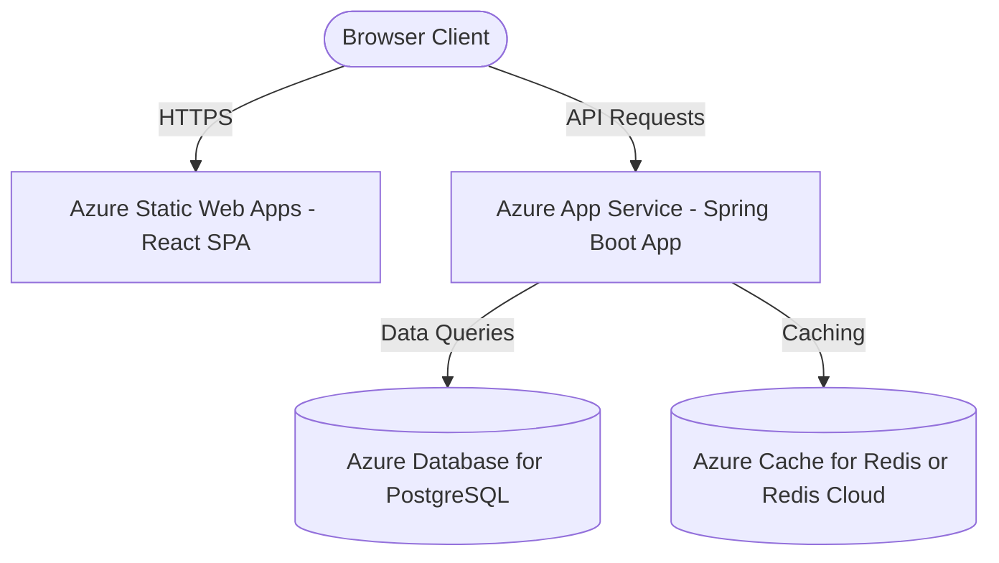

# Enterprise Azure Deployment Guide

This guide describes how to deploy the React frontend and Spring Boot backend to **Microsoft Azure** using managed developer services: **Azure Static Web Apps** (frontend) and **Azure App Service** (backend).

---

## Architecture Overview

---

## 💾 Step 1: Deploy PostgreSQL on Azure

1. Log in to the [Azure Portal](https://portal.azure.com/).
2. Click **Create a resource** and search for **Azure Database for PostgreSQL**. Choose **Flexible Server**.
3. Configure settings:
   - **Resource Group**: Create new (e.g., `lms-resources`).
   - **Server name**: `lms-postgres-db`
   - **Region**: Choose a region close to you (e.g., `East US`).
   - **Compute + storage**: Select **Burstable, B1ms** (lowest tier for cost savings/development).
   - **Admin Username**: `postgres`
   - **Password**: *Create a secure password*.
4. Under **Networking**:
   - Check **Allow public access from any Azure service within Azure to this server**.
   - Add a firewall rule named `AllowAll` with Start IP `0.0.0.0` and End IP `255.255.255.255` (to allow connection from your local machine).
5. Click **Review + Create**, then **Create**.
6. Once deployed, copy the **Server name** (endpoint, e.g., `lms-postgres-db.postgres.database.azure.com`).

---

## 🚀 Step 2: Deploy Spring Boot Backend on Azure App Service

Azure App Service is a fully managed platform for hosting web applications. We can deploy directly using Docker.

1. Search for **App Services** in the Azure Portal and click **Create** > **Web App**.
2. Configure settings:
   - **Resource Group**: Select `lms-resources`.
   - **Name**: `lms-java-backend` (creates `lms-java-backend.azurewebsites.net`).
   - **Publish**: Select **Code**.
   - **Runtime stack**: Select **Java 17**.
   - **Java web server stack**: Select **Java SE (Embedded Web Server)**.
   - **Operating System**: **Linux**.
   - **Pricing Plan**: Choose **Basic B1** or **Shared F1** (Free tier for development).
3. Click **Deployment** tab:
   - **GitHub Actions settings**: Select **Enable**.
   - **GitHub Account**: Authorize Azure to access your GitHub.
   - **Repository**: Select `Xebia_Lms`.
   - **Branch**: Select `main` (or `master`).
4. Under **Configuration** (Environment variables), add:
   - `SPRING_PROFILES_ACTIVE` = `postgres`
   - `SPRING_DATASOURCE_URL` = `jdbc:postgresql://<YOUR_POSTGRES_SERVER>.postgres.database.azure.com:5432/postgres?sslmode=require`
   - `SPRING_DATASOURCE_USERNAME` = `postgres`
   - `SPRING_DATASOURCE_PASSWORD` = `<YOUR_PASSWORD>`
   - `REDIS_URL` = `<YOUR_REDIS_CLOUD_URL>`
   - `CLOUDINARY_CLOUD_NAME` = `dnplvm1es`
   - `CLOUDINARY_API_KEY` = `658889419438443`
   - `CLOUDINARY_API_SECRET` = `<YOUR_CLOUDINARY_SECRET>`
   - `WEBSITES_PORT` = `8082`
5. Click **Review + create** and **Create**.
6. Once active, your backend API will be live at `https://lms-java-backend.azurewebsites.net`.

---

## 🎨 Step 3: Deploy React Frontend on Azure Static Web Apps

Azure Static Web Apps automatically builds and hosts React/Vite applications directly from GitHub.

1. Search for **Static Web Apps** in the Azure Portal and click **Create**.
2. Configure settings:
   - **Resource Group**: Select `lms-resources`.
   - **Name**: `lms-frontend`
   - **Plan type**: **Free** (includes SSL, custom domains, and global CDN).
3. Under **Deployment details**:
   - **Source**: Select **GitHub** and authorize.
   - Select your repository (`Xebia-LMS`) and main branch.
4. Under **Build Details** (Build Presets):
   - **Build Presets**: Select **Vite**.
   - **App location**: `/frontend` (path to the React app subdirectory).
   - **Api location**: Leave empty.
   - **Output location**: `dist` (Vite's build output folder).
5. Click **Review + create** and **Create**.
6. Azure will automatically generate a GitHub Actions workflow in your repository and deploy the frontend.
7. **Set API URL Variable**:
   - Go to your Static Web App resource in Azure portal.
   - Click **Environment variables** under settings.
   - Add a variable:
     - **Name**: `VITE_API_URL`
     - **Value**: `https://lms-java-backend.azurewebsites.net/api`
   - Click **Save**.
